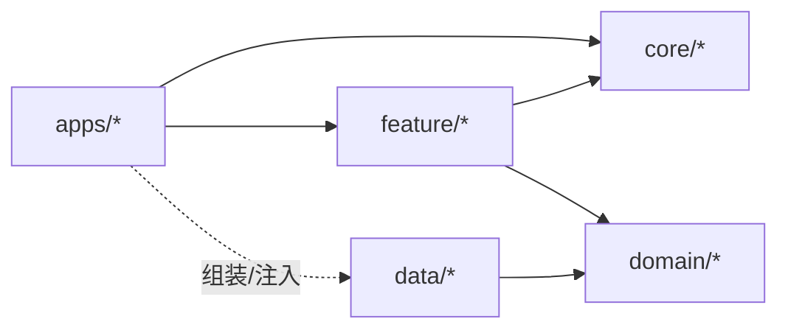

### Module 划分规范（最终版）

本规范只定义：**结构**、**依赖规则**、**模块职责**、**使用方式**。照此执行即可。

---

### 1. 顶层结构（固定）

- **`apps/`**：App 壳（组装 + 导航）
- **`core/`**：第一底层扩展库与通用组件（跨业务复用）
- **`feature/`**：业务功能（UI + MVI）
- **`domain/`**：纯业务（实体 / 用例 / 仓库接口）
- **`data/`**：数据实现（网络/缓存/仓库实现）



```text
                 +------------------+
                 |     apps/*       |
                 |  (组装 + 导航)   |
                 +--------+---------+
                          | uses
                          v
                 +------------------+
                 |   feature/*      |
                 |   (UI + MVI)     |
                 +----+--------+----+
                      |        |
                 uses |        | uses
                      v        v
            +----------------+ +------------------+
            |    core/*      | |    domain/*      |
            | common / ui    | | (纯业务抽象)     |
            +----------------+ +---------+--------+
                                        ^
                                        | implements / returns
                               +--------+---------+
                               |     data/*       |
                               | (数据实现/源)    |
                               +------------------+
```

---

### 2. 命名规范（固定）

- **模块路径**：`:apps:*`、`:core:*`、`:feature:*`、`:domain:*`、`:data:*`
- **模块名**：kebab-case（例：`:feature:anime-detail`）
- **namespace（新增模块必须遵守）**
  - apps：`com.pusu.indexed.<app>`
  - core：`com.pusu.indexed.core.<name>`
  - feature：`com.pusu.indexed.feature.<feature>`
  - domain：`com.pusu.indexed.domain.<domain>`
  - data：`com.pusu.indexed.data.<source>`

---

### 3. core 模块定义（第一底层扩展库 / 通用组件）

#### 3.1 `:core:common`（第一底层扩展库）

- **定位**：全工程最底层的“纯 Kotlin”扩展库（不含任何 Android/Compose 依赖）。
- **放什么**
  - `Result`/错误码与错误模型（通用、可序列化）
  - 分页/加载状态的通用模型（不带 UI）
  - 通用 Kotlin 扩展（String/Collection/Time 等）
  - 轻量工具（如 `DispatcherProvider` 接口、日志接口定义等）
- **不放什么**
  - 任何 AndroidX/Compose/Retrofit/OkHttp/Room 相关代码
  - 任何业务语义（不要出现 “Anime/Manga/Discover” 等）

#### 3.2 `:core:ui`（通用组件库 / Design System）

- **定位**：跨 feature 复用的 UI 基建（主题 + 组件 + 交互规范）。
- **放什么**
  - Theme（Color/Type/Shape/Spacing）
  - 通用组件：`Loading` / `ErrorView` / `EmptyView` / `TopBar` / `PrimaryButton` 等
  - 跨 feature 复用的小组件（不带业务语义）
- **不放什么**
  - 业务组件（如 `AnimeCard` 这种应放 `feature:xxx/ui/components`）

---

### 3. 依赖规则（必须遵守）

- **`apps/*`**
  - ✅ 依赖：`core/*`、`feature/*`、（可选）`domain/*`
  - ✅ 依赖：`data/*`（仅用于组装/注入）
  - ❌ 不写业务逻辑
- **`feature/*`**
  - ✅ 依赖：`core/*`、`domain/*`
  - ✅ 依赖：`data/*`（允许，但推荐通过 domain 接口注入）
  - ❌ 不依赖：`apps/*`
- **`core/*`**
  - ✅ `core:common`：只依赖纯 Kotlin
  - ✅ `core:ui`：可依赖 Compose/AndroidX（但不依赖 feature/domain/data）
- **`domain/*`**
  - ✅ 只依赖：纯 Kotlin（可依赖 `:core:common`）
  - ❌ 不依赖：Android/Compose/Retrofit/OkHttp/Room、`apps/*`、`feature/*`、`data/*`
- **`data/*`**
  - ✅ 依赖：`core/*`、`domain/*`（实现 domain 接口/返回 domain 模型）
  - ❌ 不依赖：`apps/*`、`feature/*`

---

### 4. feature 模块模板（MVI 固定分包）

每个 `feature:*` 必须包含：

- **`ui/`**
  - `*Route`（对外入口 + 参数）
  - `*Screen`（渲染 + 把交互转 Intent）
  - `components/`（仅本 feature 复用的业务组件）
- **`presentation/`**
  - `*Contract`（`State / Intent / Event`）
  - `*ViewModel`（或 `*Store`）

禁止创建：`repos/ models/ viewModels/ views` 这类“按技术词汇的总目录”。

---

### 5. 模块职责边界（固定）

- **`domain/*`**：定义业务模型、用例、仓库接口（纯 Kotlin）
- **`data/*`**：实现仓库接口、封装数据源（网络/本地/缓存）
- **`feature/*`**：只做 UI + 状态机（MVI），通过 domain/usecase 获取数据
- **`apps/*`**：只做导航与依赖组装（把 data 实现注入给 feature/domain）

---

### 6. 使用说明

#### 6.1 在一个 app 中接入 feature

- 在 `apps:<app>` 的 `dependencies` 中 `implementation(project(":feature:<name>"))`
- 在 app 的导航图里使用该 feature 暴露的 `*Route/*Screen`

#### 6.2 注入数据实现（固定模式）

**domain 定义接口 → data 提供实现 → app 负责注入**（手动注入或 DI 均可）。

#### 6.3 新增一个 `feature:xxx`

1. 创建目录：`feature/xxx/`
2. `settings.gradle.kts`：`include(":feature:xxx")`
3. `build.gradle.kts`：Android Library + namespace `com.pusu.indexed.feature.xxx`
4. 建包：`ui/`、`presentation/`
5. 对外只暴露入口：`XxxRoute` / `XxxScreen`（其余尽量 `internal`）
