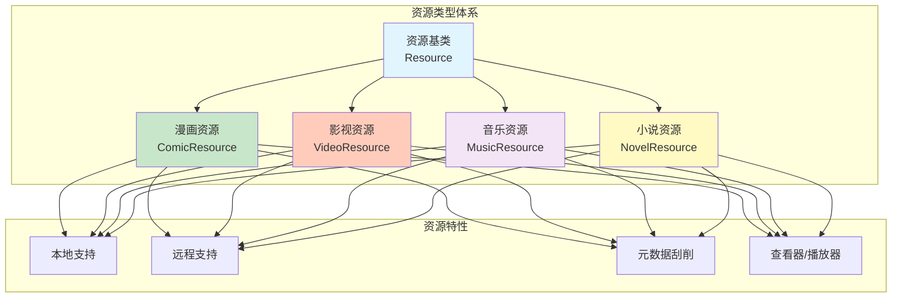

# 资源类型扩展规划

## 资源类型概览



---

## 1. 漫画资源（Comic）

### 当前状态
- ✅ 架构设计完成
- ✅ 领域模型定义
- 🚧 扫描器实现中
- ❌ 阅读器未实现

### 支持格式

| 格式 | 说明 | 优先级 |
|------|------|--------|
| **图片文件夹** | jpg/png/webp | ✅ 高 |
| **CBZ** | ZIP 压缩的图片 | ✅ 高 |
| **CBR** | RAR 压缩的图片 | 🟡 中 |
| **PDF** | PDF 格式漫画 | 🟡 中 |
| **EPUB** | 电子书格式 | 🟢 低 |

### 文件结构规范

```
LibraryRoot/
├── MangaTitle1/
│   ├── Chapter_001/
│   │   ├── 001.jpg
│   │   ├── 002.jpg
│   │   └── ...
│   ├── Chapter_002.cbz
│   └── Chapter_003/
│       └── ...
├── MangaTitle2/
│   └── ...
```

### 元数据来源

- **MyAnimeList** (MAL)
- **AniList**
- **Kitsu**
- **ComicVine**
- **本地 metadata.json**

### 功能特性

- [x] 本地文件扫描
- [ ] 在线漫画源
- [ ] 阅读器（翻页、缩放、书签）
- [ ] 阅读进度同步
- [ ] 收藏和标签
- [ ] 搜索和筛选

### 实现计划

**Phase 1.1: 本地漫画完善**（当前）
- 实现 LocalScanner
- 实现索引系统
- 实现元数据刮削

**Phase 1.2: 阅读器开发**（3个月后）
- 图片查看器
- 翻页动画
- 缩放和滚动
- 阅读设置

**Phase 1.3: 在线源支持**（6个月后）
- 在线源插件系统
- 下载管理
- 缓存策略

---

## 2. 影视资源（Video）

### 当前状态
- ❌ 未开始

### 支持格式

| 格式 | 说明 | 优先级 |
|------|------|--------|
| **MP4** | H.264/H.265 | ✅ 高 |
| **MKV** | Matroska 容器 | ✅ 高 |
| **AVI** | 传统格式 | 🟡 中 |
| **MOV** | QuickTime | 🟡 中 |
| **WebM** | Web 格式 | 🟢 低 |

### 文件结构规范

```
LibraryRoot/
├── MovieTitle1 (2020)/
│   └── MovieTitle1.2020.1080p.BluRay.mp4
├── TVSeriesTitle1/
│   ├── Season 01/
│   │   ├── S01E01 - Episode Title.mkv
│   │   ├── S01E02 - Episode Title.mkv
│   │   └── ...
│   ├── Season 02/
│   │   └── ...
│   └── ...
```

### 元数据来源

- **TMDB** (The Movie Database)
- **豆瓣电影**
- **IMDb**
- **本地 NFO 文件**

### 功能特性

- [ ] 视频文件识别
- [ ] 视频信息解析（分辨率、编码、时长）
- [ ] 视频播放器集成
- [ ] 字幕管理（SRT、ASS、VTT）
- [ ] 播放进度同步
- [ ] 收藏和评分
- [ ] 剧集管理

### 技术挑战

1. **视频解码**：需要平台特定的解码器
2. **字幕渲染**：需要字幕解析和渲染
3. **流媒体**：支持在线播放
4. **转码**：可能需要视频转码

### 实现计划

**Phase 4.1: 基础识别**（9个月后）
- 视频文件扫描
- 视频信息解析
- 基础元数据管理

**Phase 4.2: 播放器集成**（10个月后）
- 视频播放器组件
- 播放控制
- 字幕显示

**Phase 4.3: 高级功能**（11个月后）
- 播放进度同步
- 字幕管理
- 转码支持

---

## 3. 音乐资源（Music）

### 当前状态
- ❌ 未开始

### 支持格式

| 格式 | 说明 | 优先级 |
|------|------|--------|
| **MP3** | 最常用格式 | ✅ 高 |
| **FLAC** | 无损格式 | ✅ 高 |
| **AAC** | Apple 格式 | 🟡 中 |
| **OGG** | 开源格式 | 🟡 中 |
| **WAV** | 未压缩 | 🟢 低 |

### 文件结构规范

```
LibraryRoot/
├── ArtistName1/
│   ├── AlbumName1 (2020)/
│   │   ├── 01 - Track Title.mp3
│   │   ├── 02 - Track Title.mp3
│   │   ├── cover.jpg
│   │   └── ...
│   ├── AlbumName2 (2021)/
│   │   └── ...
│   └── ...
├── ArtistName2/
│   └── ...
```

### 元数据来源

- **MusicBrainz**
- **Last.fm**
- **Discogs**
- **ID3 标签**（文件内嵌）

### 功能特性

- [ ] 音频文件识别
- [ ] ID3 标签解析
- [ ] 音频播放器集成
- [ ] 播放列表管理
- [ ] 歌词显示（LRC、SRT）
- [ ] 专辑封面显示
- [ ] 播放历史
- [ ] 随机播放和循环

### 技术挑战

1. **音频解码**：需要平台特定的解码器
2. **ID3 标签**：不同版本的 ID3 标签解析
3. **歌词同步**：时间轴同步显示
4. **音频可视化**：频谱显示（可选）

### 实现计划

**Phase 5.1: 基础识别**（12个月后）
- 音频文件扫描
- ID3 标签解析
- 基础元数据管理

**Phase 5.2: 播放器集成**（13个月后）
- 音频播放器组件
- 播放控制
- 专辑封面显示

**Phase 5.3: 高级功能**（14个月后）
- 播放列表管理
- 歌词显示
- 播放历史

---

## 4. 小说资源（Novel）

### 当前状态
- ❌ 未开始

### 支持格式

| 格式 | 说明 | 优先级 |
|------|------|--------|
| **TXT** | 纯文本 | ✅ 高 |
| **EPUB** | 电子书标准 | ✅ 高 |
| **MOBI** | Kindle 格式 | 🟡 中 |
| **PDF** | PDF 文档 | 🟡 中 |
| **FB2** | FictionBook | 🟢 低 |

### 文件结构规范

```
LibraryRoot/
├── NovelTitle1/
│   ├── NovelTitle1.epub
│   └── cover.jpg
├── NovelTitle2/
│   ├── Chapter_001.txt
│   ├── Chapter_002.txt
│   └── ...
├── NovelTitle3.txt
└── ...
```

### 元数据来源

- **Goodreads**
- **豆瓣读书**
- **本地 EPUB 元数据**
- **文件名解析**

### 功能特性

- [ ] 电子书文件识别
- [ ] EPUB/MOBI 解析
- [ ] 阅读器集成
- [ ] 阅读进度同步
- [ ] 书签和笔记
- [ ] 目录导航
- [ ] 字体和主题设置

### 技术挑战

1. **EPUB 解析**：需要 ZIP 解析和 XML 解析
2. **文本渲染**：富文本渲染和排版
3. **分页算法**：文本分页计算
4. **字体支持**：自定义字体加载

### 实现计划

**Phase 6.1: 基础识别**（15个月后）
- 电子书文件扫描
- EPUB/MOBI 解析
- 基础元数据管理

**Phase 6.2: 阅读器集成**（16个月后）
- 文本阅读器组件
- 阅读控制
- 目录导航

**Phase 6.3: 高级功能**（17个月后）
- 书签和笔记
- 阅读进度同步
- 字体和主题

---

## 资源类型对比

| 特性 | 漫画 | 影视 | 音乐 | 小说 |
|------|------|------|------|------|
| **文件大小** | 中等（MB） | 大（GB） | 小（MB） | 小（KB-MB） |
| **扫描速度** | 快 | 慢 | 快 | 快 |
| **元数据复杂度** | 中 | 高 | 中 | 低 |
| **播放器复杂度** | 中 | 高 | 中 | 低 |
| **存储需求** | 中 | 高 | 低 | 低 |

---

## 统一资源抽象

### 资源接口设计

```kotlin
/**
 * 资源基类接口
 */
interface Resource {
    val id: String
    val type: ResourceType
    val title: String
    val metadata: ResourceMetadata
    val files: List<ResourceFile>
    val createdAt: Long
    val updatedAt: Long
}

/**
 * 资源元数据接口
 */
interface ResourceMetadata {
    val title: String?
    val description: String?
    val tags: List<String>
    val cover: String?
    val year: Int?
    val rating: Float?
    val customFields: Map<String, Any>
}

/**
 * 资源特定元数据扩展
 */
interface ComicMetadata : ResourceMetadata {
    val author: String?
    val publisher: String?
    val chapters: List<ChapterInfo>
}

interface VideoMetadata : ResourceMetadata {
    val director: String?
    val cast: List<String>
    val duration: Long?  // 秒
    val resolution: String?
    val subtitles: List<SubtitleInfo>
}

interface MusicMetadata : ResourceMetadata {
    val artist: String?
    val album: String?
    val trackNumber: Int?
    val duration: Long?  // 秒
    val lyrics: String?
}

interface NovelMetadata : ResourceMetadata {
    val author: String?
    val publisher: String?
    val isbn: String?
    val chapters: List<ChapterInfo>
}
```

---

## 插件开发指南

### 创建新资源类型插件

1. **实现 ResourcePlugin 接口**
2. **定义资源模型**
3. **实现扫描逻辑**
4. **实现元数据解析**
5. **注册插件**

### 示例：创建影视插件

```kotlin
class VideoPlugin : ResourcePlugin {
    override val resourceType = ResourceType.VIDEO
    
    override suspend fun scanFiles(
        rootPath: String,
        config: ScanConfig
    ): ScanResult {
        // 实现视频文件扫描逻辑
    }
    
    override suspend fun parseMetadata(
        file: ResourceFile
    ): ResourceMetadata {
        // 实现视频元数据解析
    }
    
    override fun validateFile(file: File): Boolean {
        // 验证是否为视频文件
        return file.extension in listOf("mp4", "mkv", "avi", "mov")
    }
    
    override fun getSupportedExtensions(): List<String> {
        return listOf("mp4", "mkv", "avi", "mov", "webm")
    }
}
```

---

## 扩展性考虑

### 未来可能支持的类型

- **图片**：照片管理
- **文档**：PDF、Word、Excel
- **游戏**：游戏资源管理
- **软件**：应用程序管理

### 插件市场

- 允许第三方开发插件
- 插件审核和发布机制
- 插件版本管理
- 插件依赖管理

---

**最后更新**：2026-01-27  
**版本**：1.0.0
